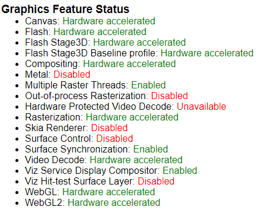
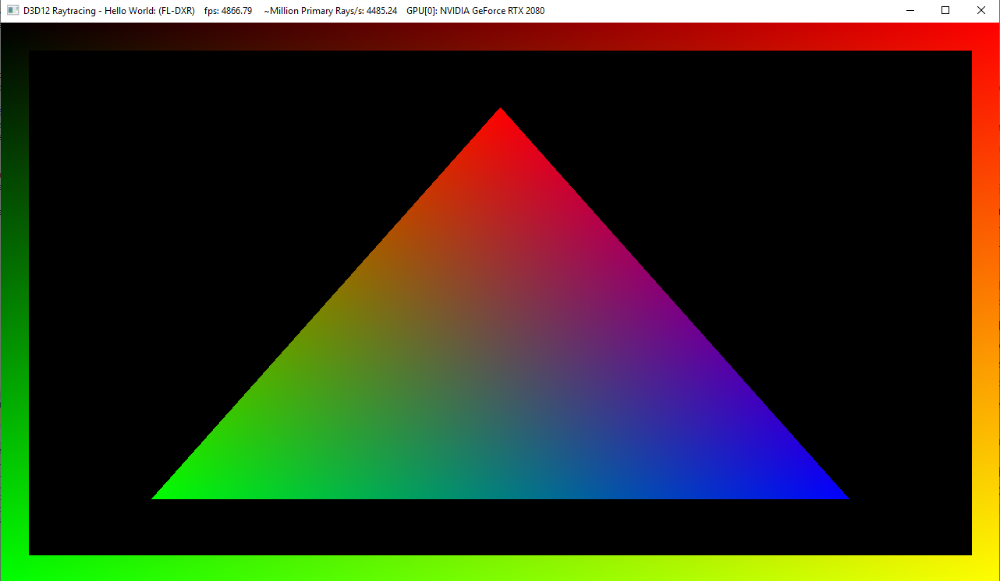
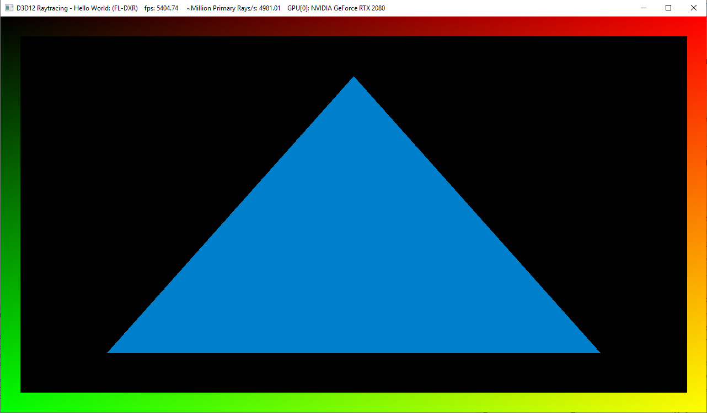
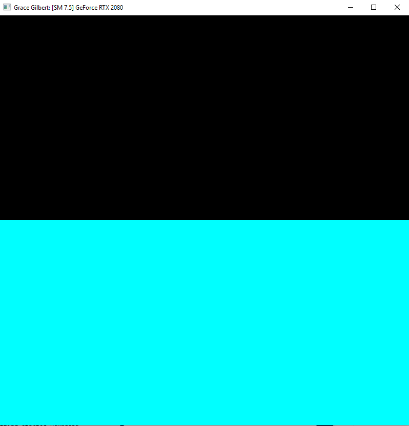
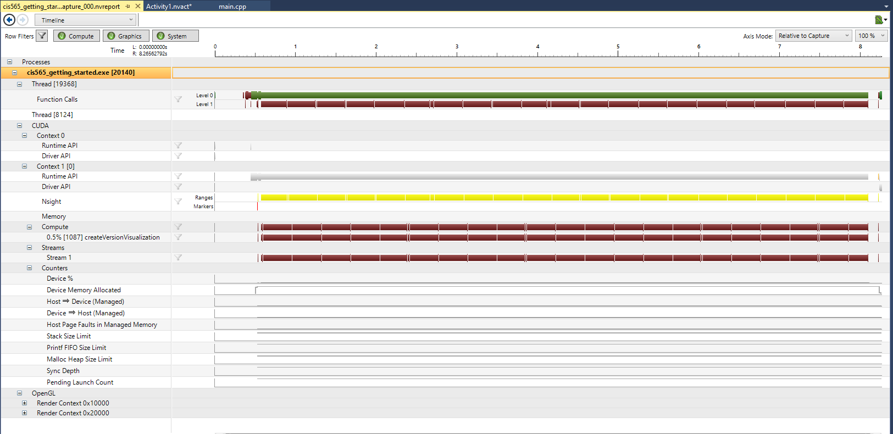
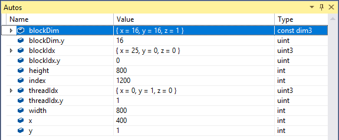
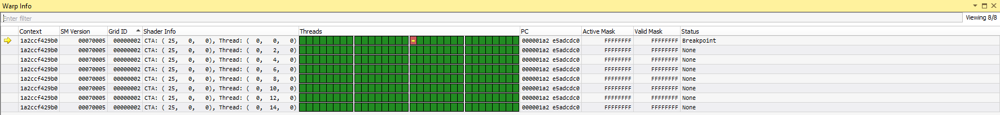

Project 0 Getting Started
====================

**University of Pennsylvania, CIS 565: GPU Programming and Architecture, Project 0**

* Grace Gilbert
  * https://www.linkedin.com/in/grace-gilbert-2493a0156, http://gracelgilbert.com
* Tested on: Windows 10, i9-9900K @ 3.60GHz 64GB, GeForce RTX 2080 40860MB (Personal Laptop)

GPU Compute Capability: 7.5

chrome:\\gpu output:

Original Triangle:

Modified Triangle:

Build and Run Test:

Timeline:

Autos Tab:

Warp Info:

